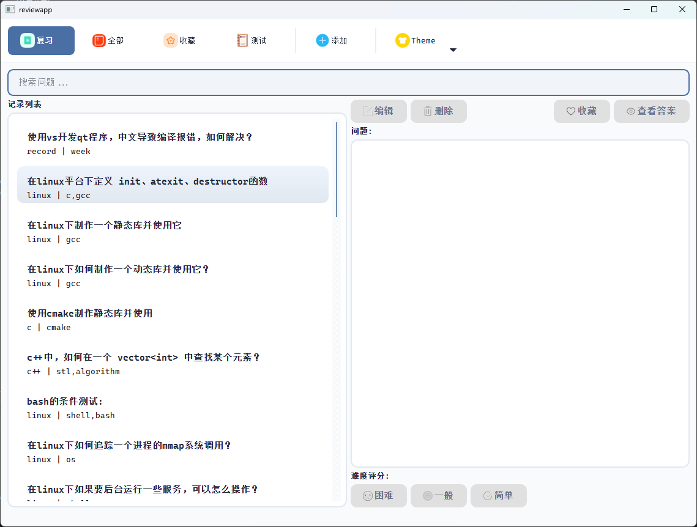
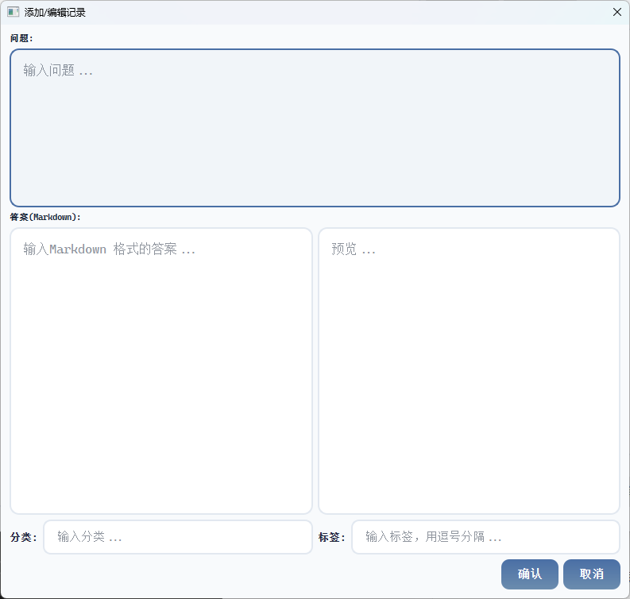

# 辅助记忆工具

+ 由于本人忘性比较大，可能两天前学习的东西、发生的一些事情，今天就有可能想不起来细节，所以趁着过年这段时间开发了这个辅助记忆工具，采用卡片式管理，可用来系统学习、复习、记忆，按照艾宾浩斯遗忘曲线来定制复习计划。也可作为自己的一个知识库，随用随查。

## 功能介绍

+ 软件主界面如下
  + 

### 记录列表

+ 记录列表分为多种不同类型

  + 复习：此时此刻需要复习的一些卡片
  + 全部：所有的卡片
  + 收藏：收藏的卡片
  + 测试：从所有的卡片中随机抽取20条

  

### 添加卡片

+ 点击添加按钮弹窗添加卡片
+ 

### 卡片操作

+ 编辑：弹出弹窗方便编辑（与添加卡片弹窗类似）
+ 删除：删除卡片
+ 收藏：收藏该卡片（之后可在收藏列表中可见）
+ 查看答案：选中一个卡片后默认是隐藏答案的，点击此按钮可查看答案

+ 困难、一般、简单：对复习的卡片进行一个掌握情况评估

  + 困难：复习Level从头开始
  + 一般：复习Level-1
  + 简单：复习Level+1

+ 复习Level

  ```c++
  enum ReviewLevel
  {
  	OneDay = 0,
  	ThreeDay = 1,
  	OneWeek = 2,
  	TwoWeek = 3,
  	OneMonth = 4,
  	ThreeMonth = 5,
  	SixMonth = 6,
  	OneYear = 7,
  	TwoYear = 8
  };
  ```

  